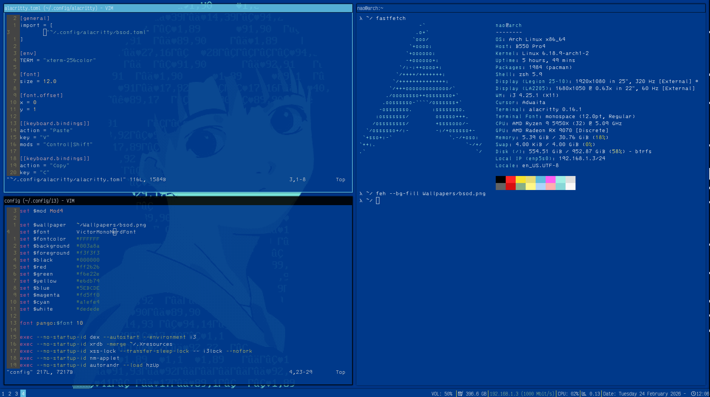
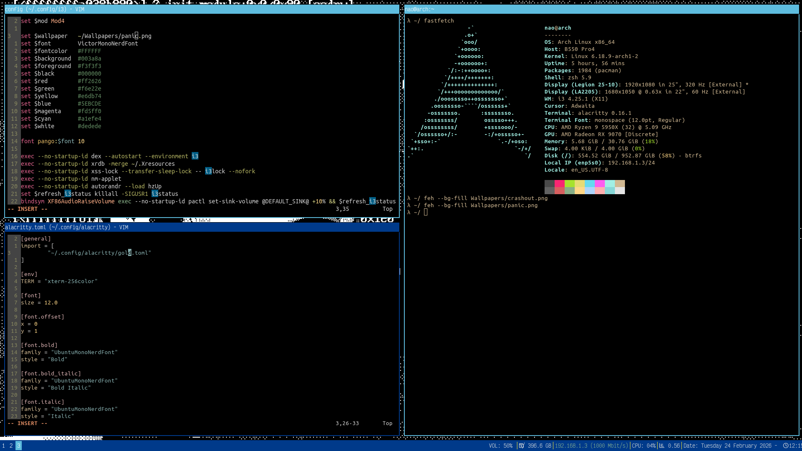
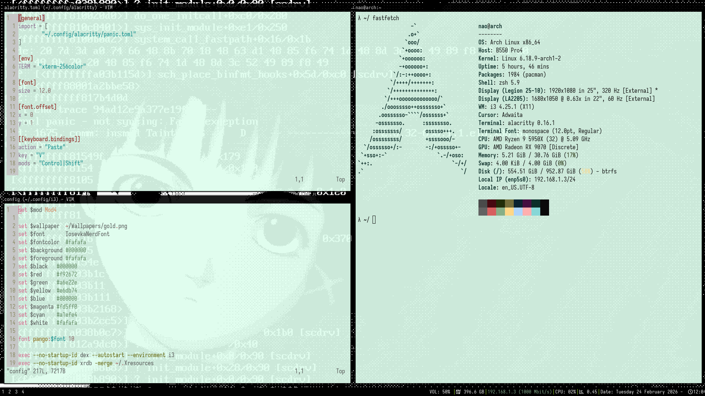
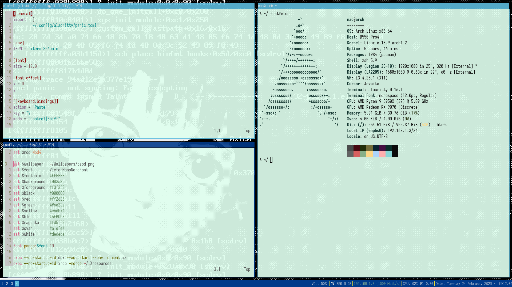

# Dotfiles

# TODO
- [ ] tmux
- [ ] linked workspace, instead of copying link it

# How it look like when making combinations

.
.
.

sources 

-> kernel sysctl params : https://madaidans-insecurities.github.io/guides/linux-hardening.html#regenerate-grub-config
-> https://wiki.archlinux.org/title/Security
-> Networking params : https://wiki.archlinux.org/title/Sysctl
https://kspp.github.io/Recommended_Settings#kernel-command-line-options
-> checker: https://github.com/a13xp0p0v/kernel-hardening-checker
